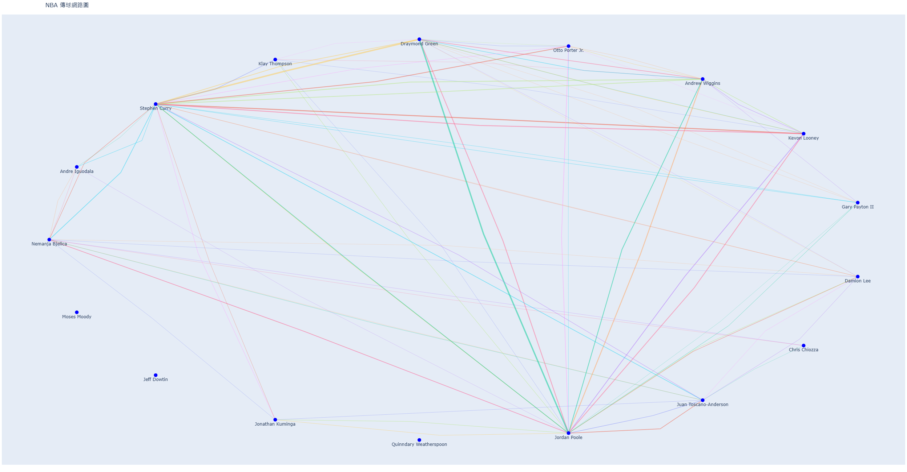

# About this project
This project is designed to visualize team performance in an NBA season, focusing on players' **PASS**, **FGM**, **FGA**, and **FG%**. 

Quick view on these abbreviations:  
&nbsp;&nbsp;&nbsp;&nbsp;&nbsp;&nbsp;&nbsp;&nbsp;&nbsp;&nbsp;&nbsp;&nbsp;&nbsp;**PASS:** &nbsp;&nbsp;Passing attempts.  
&nbsp;&nbsp;&nbsp;&nbsp;&nbsp;&nbsp;&nbsp;&nbsp;&nbsp;&nbsp;&nbsp;&nbsp;&nbsp;**FGM:** &nbsp;&nbsp;Field Goal Made.  
&nbsp;&nbsp;&nbsp;&nbsp;&nbsp;&nbsp;&nbsp;&nbsp;&nbsp;&nbsp;&nbsp;&nbsp;&nbsp;**FGA:** &nbsp;&nbsp;&nbsp;Field Goal Attempts.  
&nbsp;&nbsp;&nbsp;&nbsp;&nbsp;&nbsp;&nbsp;&nbsp;&nbsp;&nbsp;&nbsp;&nbsp;&nbsp;**FG%:** &nbsp;&nbsp;Field Goal Percentage.  

# Running the code
This program generates interactive network diagrams using the `plotly` and `networkx` modules.  
> Before running this code, please ensure both modules are installed.  
> If not, type the following installation commands in the **command window**.  
```
  pip install plotly
  pip install networkx
```
Open the code file in **Jupyter Notebook** and run it. The program will ask the user to enter the NBA season and the abbreviation of the team name. Please follow the prompts or press `Enter` to use the defaults.
* Result  
After running the program, you will see an interactive diagram as displayed below. The player's name will be displayed near the node.  
Hovering over an **edge(at the fold)** will display pass information, while hovering over a **node** will show details about the player's shot.


